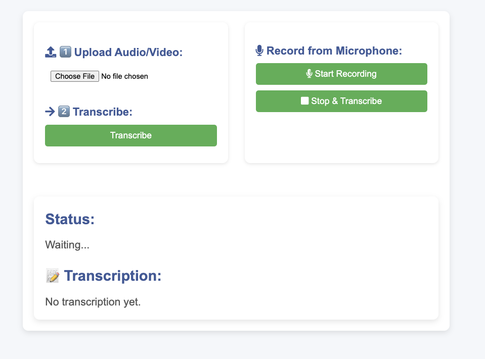
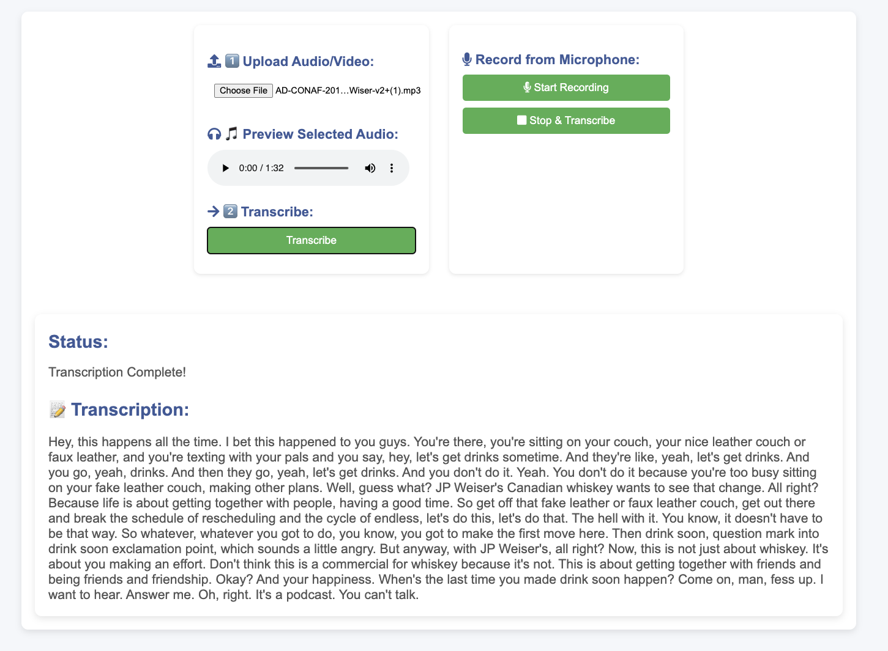

# Whisper


## Overview
Whisper is a local transcription app that allows users to convert voice into text. Users can either upload an audio/video file or record directly using a microphone, and the app will process the input to generate a transcription.

## Features
- Upload audio/video files for transcription.
- Record audio using a microphone for real-time transcription.
- Status updates during the transcription process.
- Instant display of transcribed text.

## Technology Stack
- **Backend:** Python, Flask
- **Frontend:** HTML, JavaScript, CSS
- **Transcription Engine:** Whisper AI Model

## How to Use

### Upload Audio/Video File
1. Click the **"Choose File"** button.
2. Select an audio or video file from your device.
3. Click the **"Transcribe"** button to start transcription.
4. Wait for the **"Status"** section to update.
5. The transcribed text will appear under **"Transcription"**.

### Record from Microphone
1. Click the **"Start Recording"** button.
2. Speak into the microphone.
3. Click the **"Stop & Transcribe"** button to end recording and start transcription.
4. Wait for the **"Status"** section to update.
5. The transcribed text will appear under **"Transcription"**.

## Status Messages
- **Waiting...** - No transcription is in progress.
- **Processing...** - The app is currently transcribing the audio.
- **Completed** - The transcription is ready and displayed.

## Supported File Formats
- Audio: MP3, WAV, FLAC
- Video: MP4, AVI, MOV (audio extracted for transcription)

## Installation & Setup
1. Clone the repository:
   ```bash
   git clone https://github.com/sthpratik/whisper.git
   cd whisper
   ```
2. Create a virtual environment:
   ```bash
   python -m venv venv
   source venv/bin/activate  # On Windows use `venv\Scripts\activate`
   ```
3. Install dependencies:
   ```bash
   pip install -r requirements.txt
   ```
4. Run the Flask server:
   ```bash
   python app.py
   ```
5. Open the browser and navigate to:
   ```
   http://localhost:3050
   ```

## Troubleshooting
- **File upload not working?** Ensure the file format is supported.
- **Microphone not recording?** Check browser permissions for microphone access.
- **Slow transcription?** Large files may take longer to process; try a shorter clip.

## Contact & Support
For issues, please open a GitHub issue or contact support at **sth.pratik@gmail.com**.

